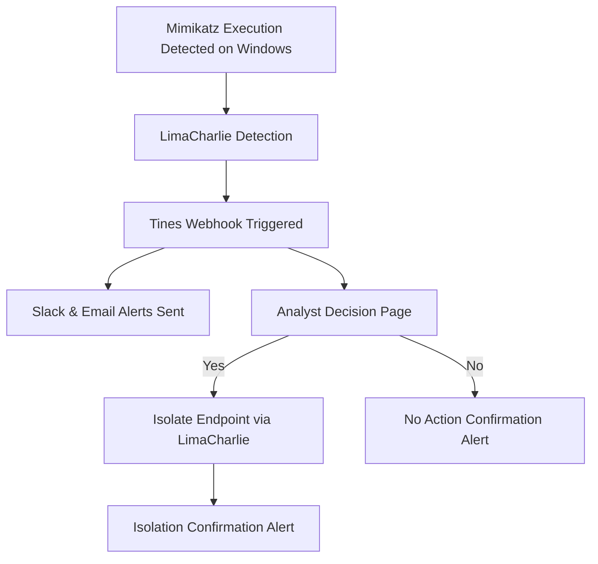

# LimaCharlie + Tines SOAR Integration Project

## 🌟 Project Overview

This project demonstrates an end-to-end Security Orchestration, Automation, and Response (SOAR) workflow using:

* **LimaCharlie EDR** for detecting malicious activity (simulated Mimikatz execution).
* **Tines SOAR** for automating alert forwarding, analyst decision-making, and endpoint isolation.
* **Slack & Email** for real-time alert notifications.

---

## 🔢 Project Goals

* Understand how SOAR and EDR platforms work together.
* Automate brute force attack detection and response workflows.
* Showcase practical cybersecurity automation skills.

---

## 🛠️ Tools & Platforms

* Windows 10 VM (Target Endpoint)
* LimaCharlie ([https://limacharlie.io](https://limacharlie.io))
* Tines ([https://tines.com](https://tines.com))
* Slack (for alert notifications)
* Email (for alert notifications)

---

## 🕺 Workflow Diagram



---

## 🔄 Scenario Description

A large organization with multiple endpoints detects Mimikatz activity on one machine. The CISO team decides to implement automated detection and response measures to protect the organization.

---

## 🗋 Step-by-Step Walkthrough

### 1. LimaCharlie Setup

* Create an organization on [LimaCharlie](https://limacharlie.io).
* Deploy Windows sensor:

  * Create installation key.
  * Add Windows sensor using the key.
  * Confirm sensor installation.

### 2. Simulate Mimikatz Execution

* Download Mimikatz from GitHub.
* Execute `mimikatz.exe` on the Windows VM.
* Verify detection in LimaCharlie Timeline: look for a `new process` log event.

### 3. Create Detection Rule in LimaCharlie

* Navigate to Automation > DR Rules.
* Create a rule for detecting Mimikatz execution (rule sample included in this repository).

### 4. Connect LimaCharlie to Tines

* Create a new story in Tines.
* Create a webhook and copy the URL.
* In LimaCharlie:

  * Go to Outputs > Add Output.
  * Stream: Detection.
  * Destination: Webhook (Tines).
  * Paste webhook URL.

### 5. Build Tines Playbook

* Set up Slack channel and get channel ID.
* Configure Slack template in Tines.
* Configure Email template in Tines.
* Create a user response page in Tines (Yes/No for isolation decision).
* Integrate LimaCharlie API:

  * Obtain JWT key.
  * Add key under Credentials in Tines.
* Set up conditional triggers:

  * If Analyst chooses Yes: Isolate endpoint + Send confirmation to Slack.
  * If Analyst chooses No: Send no-action alert.

### 6. Validation

* Rerun Mimikatz simulation.
* Confirm:

  * Alerts sent to Slack and Email.
  * Analyst prompted for decision.
  * LimaCharlie executes isolation if Yes is selected.

---

## 📅 Results

* **Mimikatz execution was successfully detected.**
* **Alerts were forwarded via Slack and Email.**
* **Automated isolation action executed based on analyst input.**

---

## 🔹 Files Included

```
/LimaCharlie-Tines-SOAR-Project
│
├── README.md
├── DR-Rule-LimaCharlie.yaml
├── Tines-Playbook-Export.json
├── Screenshots/
│   ├── playbook.png
│   ├── detection.png
```

---

## 📆 Conclusion

This project demonstrates practical SOAR skills by integrating LimaCharlie EDR and Tines SOAR platforms to detect Mimikatz and automate response actions. It showcases capabilities in:

* Endpoint Detection & Response (EDR)
* Security Automation
* Incident Response Workflow
* Real-world Threat Simulation

**Feel free to fork or adapt this repository for learning or professional portfolio use!**
**This project is inspired by mydfir project, please refer to the below YouTube link for the original work **
https://www.youtube.com/playlist?list=PLG6KGSNK4PuBWmX9NykU0wnWamjxdKhDJ

